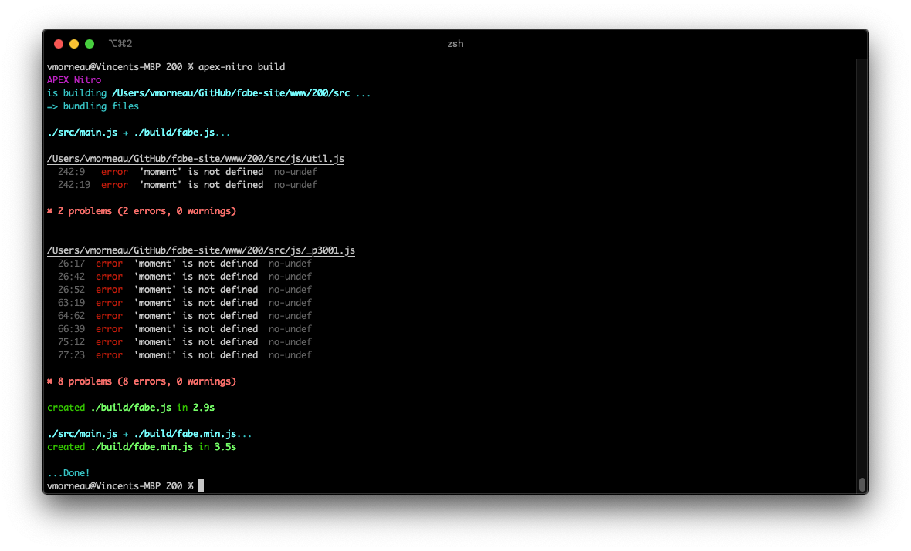

# APEX Nitro code patterns

One of the most beneficial aspect of APEX Nitro that it helps creating a clean and logical file structure for JavaScript, CSS and others.

This document explains many patterns you can use to structure your files. For simplification purposes, this document assumes the APEX Nitro files are uploaded to `Shared Components > Application Static Files`, so we will use `#APP_IMAGES#` to reference the files root path in APEX.

Your folder structure will be different based on the APEX Nitro mode you picked when running `apex-nitro init`.

## File structure in APEX Nitro Basic mode

If you have picked the basic mode for your project, here are some file structure examples you can follow.

### Basic structure 1 (simplest)

This is the simplest way we can structure files for APEX Nitro:

```bash
|-/myprojectpath/
  |-apexnitro.config.json
  |-/src/
    |-myproject.css
    |-myproject.js
```

Notes:

- This simple structure contains two files: `myproject.css` and `myproject.js`
- Both files are located in the `/myprojectpath/src/` directory

In APEX, we would reference those files as:

```bash
#APP_IMAGES#myproject#MIN#.css
#APP_IMAGES#myproject#MIN#.js
```

### Basic structure 2 (subfolders)

As you develop your application, you may require to include more and more files in your directory. In that case it becomes useful to split those files into separate subfolders. In the long run, this structure makes it easier to maintain your files and dependencies.

```bash
|-/myprojectpath/
  |-apexnitro.config.json
  |-/src/
    |-css
      |-myproject.css
    |-js
      |-myproject.js
    |-lib
      |-bootstrap.css
      |-bootstrap.js
    |-img
      |-logo.png
```

In APEX, we would reference those files as:

```bash
#APP_IMAGES#css/myproject.css
#APP_IMAGES#js/myproject.js
#APP_IMAGES#lib/bootstrap.css
#APP_IMAGES#lib/bootstrap.js
#APP_IMAGES#img/logo.png
```

## File structure in APEX Nitro Pro mode

APEX Nitro Pro mode offers the best experience for developers. It improves the performance of your files, allows next generation JavaScripts, allows CSS pre-processors and much more. This section reviews how APEX Nitro Pro works and provides file structure patterns.

### Building the source files

When using APEX Nitro Pro, the content of your `/src/` directory will no longer be synchronized to APEX. Instead, APEX Nitro compiles your `/src/` directory into a new directory called `/build/`. By compiling your code, APEX Nitro is able to tweak it so that it performs faster, resolves next generation JavaScript, and more.

There are two ways of compiling your code:

1. `apex-nitro build`: compiles `/src/` to `/build/`
1. `apex-nitro launch`: compiles `/src/` to `/build/` and opens your app, allowing real time edits.

Once your code is compiled, only the `/build/` directory is exposed to APEX. APEX only sees your compiled code. From a directory perspective, building the source files looks like this:

```bash
|-/myprojectpath/
  |-apexnitro.config.json
  |-/src/
    |-main.css
    |-main.js
```

Compiles to:

```bash
|-/myprojectpath/
  |-apexnitro.config.json
  |-/build/
    |-myproject.css
    |-myproject.js
```

### ./src/main.js

When initializing a new APEX Nitro Pro project, a simple file structure will be generated for you in your `/src/` directory:

```bash
|-/myprojectpath/
  |-apexnitro.config.json
  |-/src/
    |-main.css
    |-main.js
```

`main.js` and `main.css` represent the main entry point for your front-end code. Keep them.

We will use `main.js` to import the JavaScript, CSS and other code, and generate a single output file which will be much easier to manage in your APEX app. Let's expand our structure and add `p1.js`, `p2.js` and `p3.js`:

```bash
|-/myprojectpath/
  |-apexnitro.config.json
  |-/src/
    |-/js/
      |-p1.js
      |-p2.js
      |-p3.js
    |-main.css
    |-main.js
```

Now let's have `main.js` import `p1.js`, `p2.js` and `p3.js`:

```javascript
// main.js

import './main.css';

import p1 from './js/p1.js';
import p2 from './js/p2.js';
import p3 from './js/p3.js';

export {
	p1,
	p2,
	p3
};
```

Even if we have added 3 new files, the `/build/` directory will still generate one single output file, using your project `libraryName` from `apexnitro.config.json`:

```bash
|-/myprojectpath/
  |-apexnitro.config.json
  |-/build/
    |-myproject.css
    |-myproject.js
  |-/src/
    |-main.css
    |-main.js
```

### Minify files

By using APEX Nitro Pro, you automatically benefit from file minification. That means your code from the `/src/` directory will be compiled to a minified version in the `/build/` directory. For example:

```bash
|-/myprojectpath/
  |-apexnitro.config.json
  |-/src/
    |-main.css
    |-main.js
```

Compiles to:

```bash
|-/myprojectpath/
  |-apexnitro.config.json
  |-/build/
    |-myproject.css
    |-myproject.js
    |-myproject.min.css
    |-myproject.min.js
```

In APEX, we would reference those files as:

```bash
#APP_IMAGES#myproject#MIN#.css
#APP_IMAGES#myproject#MIN#.js
```

### Global variables and external libraries

As your codebase grow, you might be interested in using external libraries instead of writing your own code to solve common problems. When you use external libraries, those often come with global variables you can use to easily reference the objects of the library.

For example, `Moment.js` is a popular library to parse, validate, manipulate, and display dates and times in JavaScript. You can use `Moment.js` by simply adding their script in your app and start using their global variable, like this:

```javascript
<script src="moment.js"></script>
<script>
    moment().format();
</script>
```

With this code, `moment` is then a globally accessible variable. However, if we try to access the `moment` object in APEX Nitro, we will receive an error like this:



That is because APEX Nitro can't possibly know that you have included Moment.js externally in your app. To fix that, open your project `apexnitro.config.json` file, look for the `external` array and add the `moment` object:

```json
{
	"mode": "pro",
	"template": "apex-nitro-template-default",
	"libraryName": "myproject",
	"main": "./src/main.js",
	"srcFolder": "./src",
	"distFolder": "./build",
	"external": [
		"apex",
		"moment"
	],
	...
}
```

That is basically a way of saying to APEX Nitro "Don't worry, I know what I'm doing with the moment object".

### Pro structure 1 (default)

We encourage to create small granular files based on your application logic. A common structure looks like:

```bash
|-/myprojectpath/
  |-apexnitro.config.json
  |-/src/
    |-css
      |-header.css
      |-main.css
      |-footer.css
    |-js
      |-p1.js
      |-p2.js
      |-util.js
    |-main.js
```

Compiles to:

```bash
|-/myprojectpath/
  |-apexnitro.config.json
  |-/build/
    |-myproject.css
    |-myproject.js
    |-myproject.min.css
    |-myproject.min.js
```

In APEX, we would reference those files as:

```bash
#APP_IMAGES#myproject#MIN#.css
#APP_IMAGES#myproject#MIN#.js
```

### Pro structure 2 (with static files)

Often times in JavaScript or CSS, you need access to other types of files, like images, icons or external libraries. In APEX Nitro, you can put those files in a special directory name `/src/static/` and those files won't be compiled, minified or anything but you will still be able to access them.

```bash
|-/myprojectpath/
  |-apexnitro.config.json
  |-/src/
    |-static
      |-image1.png
      |-image2.png
    |-main.css
    |-main.js
```

Compiles to:

```bash
|-/myprojectpath/
  |-apexnitro.config.json
  |-/build/
    |-static
      |-image1.png
      |-image2.png
    |-myproject.css
    |-myproject.js
    |-myproject.min.css
    |-myproject.min.js
```

In APEX, we would reference those files as:

```bash
#APP_IMAGES#myproject#MIN#.css
#APP_IMAGES#myproject#MIN#.js
#APP_IMAGES#static/image1.png
#APP_IMAGES#static/image2.png
```

## Using APEX Nitro on version control systems

You may have noticed that when using `apex-nitro launch`, you APEX app opens, but the URL shows `localhost`. That is because APEX Nitro uses a proxy to display your application while accessing localhost ressources (your files). Other team members obviously don't have access to your `localhost`, so how do you work as a team using APEX Nitro?

Let's assume that you are using a version control system, like Git. Your repository should look somehow similar to this:

```bash
|-/myprojectpath/
  |-/apex/
    |-/f200.sql
  |-/packages/
    |-/mypkg.pks
    |-/mypkg.pkb
  |-/views/
    |-/myview.sql
  |-/www/
    |-/src/
      |-css/
        |-header.css
        |-footer.css
      |-js/
        |-p10.js
        |-p20.js
      |-img/
        |-background.png
        |-logo.png
      |-/build/
      |-css/
        |-myproject.css
        |-myproject.min.css
      |-js/
        |-myproject.js
        |-myproject.min.js
      |-img/
        |-background.png
        |-logo.png
```

From a structural perspective

- `/myprojectpath/www/src/` is where you do the coding.
- `/myprojectpath/www/build/` is what's being exposed to your APEX app.

To work as a team, here's the typical workflow:

1. Every team member installs APEX Nitro
1. Every team member use `apex-nitro launch` when they are working on the project front-end files (`/myprojectpath/www/src/`)
1. Have your version control system ignore the entire `/myprojectpath/www/build/` folder by adding `/myprojectpath/www/build/` to the repository `.gitignore` file
  The `/myprojectpath/www/build/` folder should not be committed
  Only `/myprojectpath/www/src/` should be committed
1. During your own development cycle, you make changes to any files you want within `/myprojectpath/www/src/` and you will be the only one seeing those changes in your APEX app through your localhost proxy, as long as you don't commit `/myprojectpath/www/src/`
1. When you your changes are stable, commit `/myprojectpath/www/src/`
1. Other team members can refresh their repository
1. Other team members APEX Nitro will automatically pick up the updated files and it will push it automatically to their app

By using this workflow, you are ensuring that your JavaScript and CSS development doesn't affect other team members until you think it's stable.

In addition to commiting your `/myprojectpath/www/src/` folder, use `apex-nitro upload` to upload your files directly in APEX Shared Components, so anyone using your app can benefit from your changes without installing APEX Nitro.
