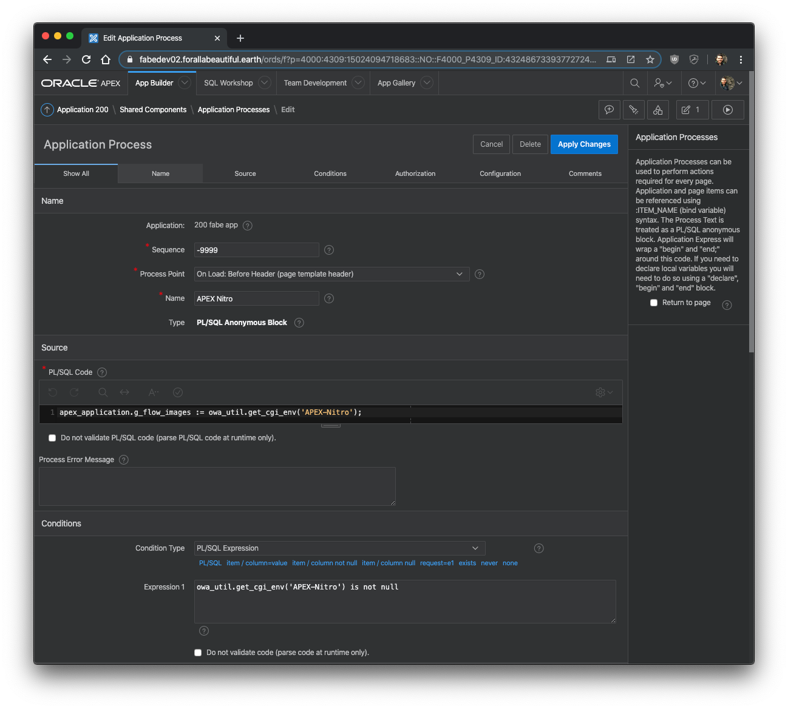
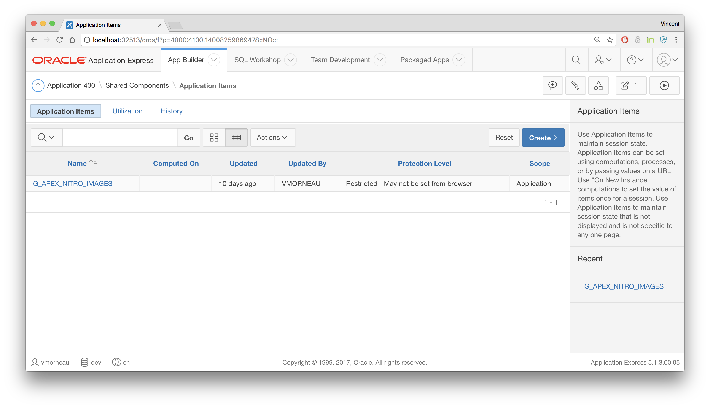
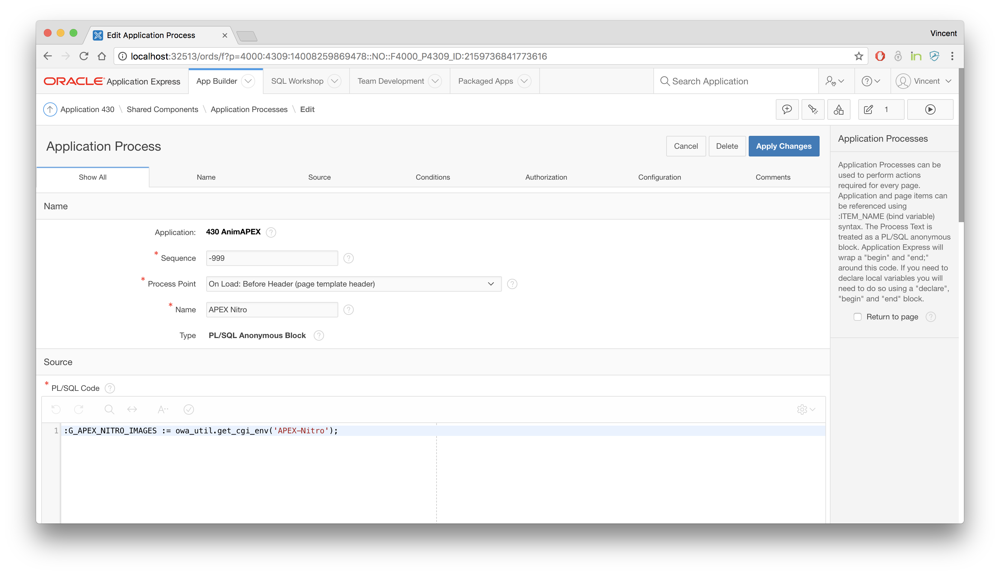
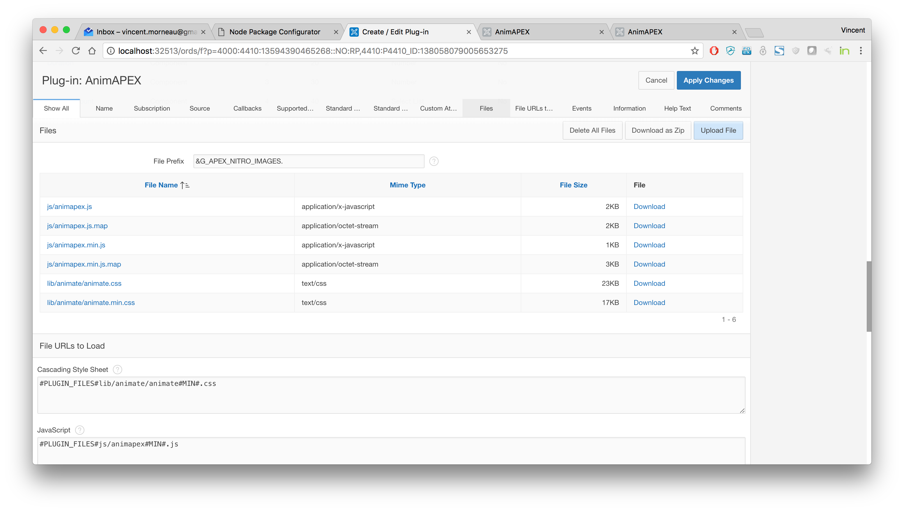

# Connect your APEX app

To enable APEX Nitro in your app, you must make two small changes in your application `Shared Components` to allow APEX Nitro to communicate properly with APEX.

## Changes to your application `Shared Components`

### 1) Build Option

APEX Nitro is only relevant in your development environment. For security purposes, a build option is used to limit APEX Nitro running only in the development environment.

Go to `Shared Components > Build Options` and create a new build option with the following attributes:

| Attribute         | Value      |
| ----------------- | ---------- |
| Build Option      | `DEV_ONLY` |
| Status            | `Include`  |
| Default on Export | `Exclude`  |

_Note: When you export your application in a different environment, our `DEV_ONLY` components will be excluded. If you re-import your application back into a development environment, make sure to manually change the status to back to `Include`._

### 2) Application Process

Go to `Shared Components > Application Processes` and create a new application process with the following attributes:

| Attribute     | Value                                           | Comment                                                 |
| ------------- | ----------------------------------------------- | ------------------------------------------------------- |
| Name          | `APEX Nitro`                                    |                                                         |
| Sequence      | `-999`                                          | Ensures this happens first                              |
| Process Point | `On Load: Before Header (page template header)` |                                                         |
| Condition     | _see below #1_                                  |                                                         |
| Source        | _see below #2_                                  | Choose `PL/SQL Expression`                              |
| Build Option  | `DEV_ONLY`                                      | Ensures this only gets run in a development environment |

- _#1 (condition)_

```sql
owa_util.get_cgi_env('APEX-Nitro') is not null
```

- _#2 (source)_

```sql
apex_application.g_flow_images := owa_util.get_cgi_env('APEX-Nitro'); /* (1) */
-- apex_application.g_company_images := owa_util.get_cgi_env('APEX-Nitro'); /* (2) */
-- apex_application.g_theme_file_prefix := owa_util.get_cgi_env('APEX-Nitro'); /* (3) */
-- :G_APEX_NITRO_IMAGES := owa_util.get_cgi_env('APEX-Nitro'); /* (4) */
```

There are four choices (see commented lines), but you must pick one. Refer to the Matrix below to choose the best option for your application.

| Option | Files location in APEX                                                                           | Substitution String Override         | How to use                                                                    |
| ------ | ------------------------------------------------------------------------------------------------ | ------------------------------------ | ----------------------------------------------------------------------------- |
| 1      | Application Static Files                                                                         | apex_application.g_flow_images       | `#APP_IMAGES#app#MIN#.js` <br /> `#APP_IMAGES#app#MIN#.css`                   |
| 2      | Workspace Static Files                                                                           | apex_application.g_company_images    | `#WORKSPACE_IMAGES#app#MIN#.js` <br /> `#WORKSPACE_IMAGES#app#MIN#.css`       |
| 3      | Theme Static Files                                                                               | apex_application.g_theme_file_prefix | `#THEME_IMAGES#app#MIN#.js` <br /> `#THEME_IMAGES#app#MIN#.css`               |
| 4      | Custom Application Item that contains the path for your files (supports APEX plugin development) | :G_APEX_NITRO_IMAGES                 | `&G_APEX_NITRO_IMAGES.app#MIN#.js` <br /> `&G_APEX_NITRO_IMAGES.app#MIN#.css` |



## APEX Plugin Development

APEX Nitro is useful for APEX plugin development, because often times plugins comes with important JavaScript, CSS and other files bundled. To enable APEX Nitro for plugin development, follow those simple steps:

- Add an application item called `G_APEX_NITRO_IMAGES` 
- In your `Application Processes > APEX Nitro` PL/SQL source code, use `:G_APEX_NITRO_IMAGES := owa_util.get_cgi_env('APEX-Nitro');` 
- In the APEX plugin you are developing, under the section `Files`, add `&G_APEX_NITRO_IMAGES.` to the File Prefix: 

Notes:

- In the development environment, `G_APEX_NITRO_IMAGES` will be populated when APEX Nitro is launched and the plugin file prefix will point to the APEX Nitro files.
- In the production environment, `G_APEX_NITRO_IMAGES` will be empty, and the plugin file prefix will point to the database files as it should.
