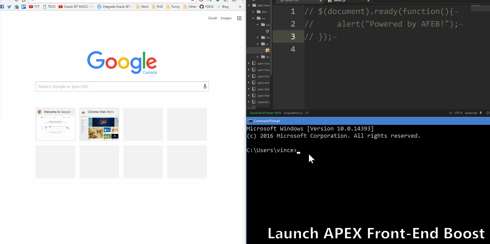

# Features Examples

## Browsersync


## Sass
You write:
```scss
$primary-color: #333;

body {
    color: $primary-color;
}

nav {
    ul {
        margin: 0;
        padding: 0;
    }

    li {
        display: inline-block;
    }

    a {
        display: block;
    }
}
```
Compiles into:
```css
body {
    color: #333;
}

nav ul {
    margin: 0;
    padding: 0;
}

nav li {
    display: inline-block;
}

nav a {
    display: block;
}
```

## Autoprefixer
You write:
```css
a { display: flex }
```
Compiles into:
```css
a {
    display: -webkit-box;
    display: -webkit-flex;
    display: -ms-flexbox;
    display: flex
}
```

## UglifyJS
You write:
```javascript
function myFunction() {
    console.log("Hello World!");
}
```
Compiles into:
```javascript
function myFunction(){console.log("Hello World!")}
```

## Sourcemaps
Map the final (concatenated and minified) file to your original source file.  
**Example:**  
Your application is pointing to `app.min.css`, but the browser reads `custom.scss`  

