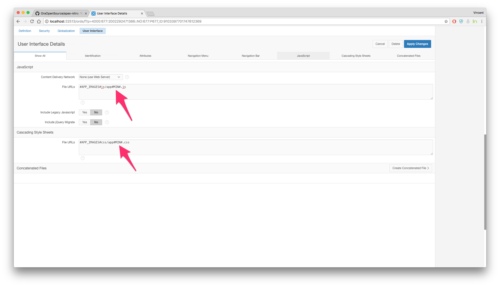
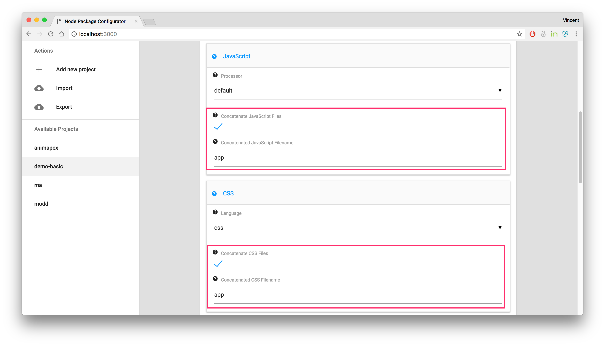
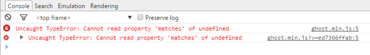
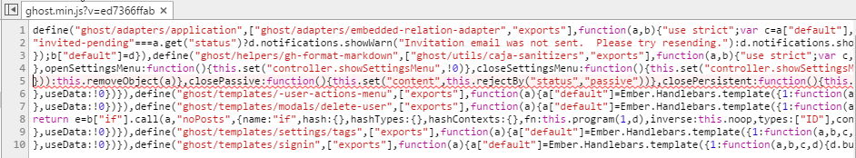
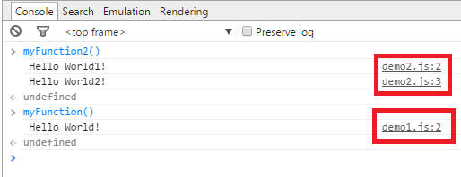
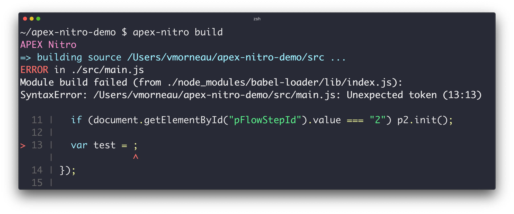
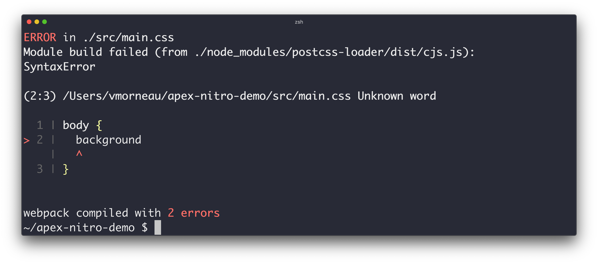
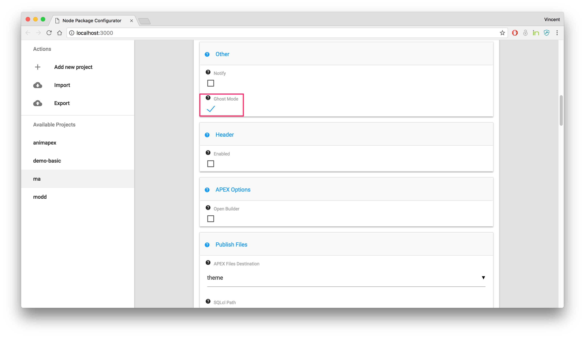

# APEX Nitro Features

Here are the main features of APEX Nitro. Some of these are activated automatically, some of them you need to activate yourself in your project configuration.

## Browser Synchronization

This is perhaps the number one reason to use APEX Nitro. Browser synchronization allows you to see real-time changes to the application without manual refresh.

When you have launched APEX Nitro, a service runs in the background and watches for any changes made to any files within your project source directory. When a change is detected, APEX Nitro re-compiles the source code and injects it automatically to your APEX application through web socket technologies.


## Minification

APEX Nitro automatically removes unnecessary characters from external files without changing the functionality. These unnecessary characters usually include white space characters, new line, comments and sometimes block delimiters, which are used to add readability to the code but are not required for it to execute. This considerably enhances the performance due to smaller file sizes.

**Example:**

1. `/project/src/js/app.js`

   ```javascript
   apex.server.process(
      "test", {
         x01: "test",
         pageItems: "#P1_DEPTNO,#P1_EMPNO"
      }, {
         success: function(data) {
               console.log(data);
         }
      }
   );
   ```

**Compiles to:**

1. `/project/dist/js/app.min.js`

   ```javascript
   apex.server.process("test",{x01:"test",pageItems:"#P1_DEPTNO,#P1_EMPNO"},{success:function(e){console.log(e)}});
   ```

This example has a compression ratio of 41.05%. It makes a considerable difference on large files.

Because of the minification process, you are able to use the `#MIN#` substitution string in APEX when referencing your files. Example: `#APP_IMAGES#js/app#MIN#.js`



APEX Nitro does the minification automatically, but without it the reference would have to be `#APP_IMAGES#js/app.js`.

## Concatenation

APEX Nitro automatically combines multiple source files into a single file. This reduces the number of HTTP requests to the server thereby increasing performance. In addition, referencing a single external file within an APEX app makes programming simpler.

**Example:**

1. `/project/src/js/app1.js`

   ```javascript
   console.log(1);
   ```

2. `/project/src/js/app2.js`

   ```javascript
   console.log(2);
   ```

**Compile to:**

1. `/project/dist/js/app.js` *(unminified)*:

   ```javascript
   console.log(1);
   console.log(2);
   ```

2. `/project/dist/js/app.min.js` *(minified)*:

   ```javascript
   console.log(1);console.log(2);
   ```

Regardless of the number of source files and their file names, they are always going to be compiled as one. That makes it easy to reference in APEX. Example: `#APP_IMAGES#js/app#MIN#.js`.

APEX Nitro does **not** concatenate automatically, it has to be activated in the project configuration through `apex-nitro config <project>`. When activating the concatenation, you also have to provide a name for the concatenated file.



## Source Mapping

Once CSS and JavaScript code has been minified and concatenated, it becomes difficult to identify where an error occurs in the original source file. When that happens, your browser's debugger indicates that the error is on line 1.

**Example without source maps:**


Clicking on the link opens the code, and shows this mess:


It's hard to read and harder to understand. To overcome this, APEX Nitro automatically adds source maps to your code, which aid in debugging minified and concatenated files by easily tracing the code back to the original source file.

**Example of Sass source maps:**  


**Example of JavaScript source maps:**  


## Error Handling

As opposed to PL/SQL being a compiled language, CSS and JavaScript are interpreted at runtime. The obvious downside of interpreted languages is that we can slip syntactically invalid code into production. APEX Nitro includes code linters that will notify the developer of syntax errors upon saving a file.

**Example of a JavaScript error warning:**



**Example of a CSS error warning:**



When an error is raised, the source file will not be compiled. You will have to fix the error before the file is compiled and synchronized to APEX again.

## CSS Preprocessing

A CSS preprocessor is a program that allows generation of CSS from the preprocessor enhanced syntax making the CSS structure more readable and easier to maintain. The main benefits of a CSS preprocessor are to implement CSS variables, nesting and functions. APEX Nitro comes pre-wired for SASS and Less.

**Example:**

1. `/project/src/scss/_module1.scss`

   ```scss
   .parent-class {
      background-color: lightblue;

      .child-class {
         background-color: lightpink;
      }
   }
   ```

2. `/project/src/scss/app.scss`

   ```scss
   @import "module1";

   $primary-color: lightgreen;

   .t-Login-region {
      background-color: $primary-color;
   }
   ```

**Compiles to:**

1. `/project/dist/css/app.css`

   ```css
   .parent-class {
   background-color: lightblue; }
   .parent-class .child-class {
      background-color: lightpink; }

   .t-Login-region {
   background-color: lightgreen; }
   ```

2. `/project/dist/css/app#MIN#.css`

   ```css
   .parent-class{background-color:#add8e6}.parent-class .child-class{background-color:#ffb6c1}.t-Login-region{background-color:#90ee90}
   ```

## Auto-Prefixer

Some CSS properties require complex knowledge of browser vendor-specific prefixes. These special CSS properties are hard to remember and can cause a lot of problems in browser compatibility.

APEX Nitro comes with auto-prefixer out of the box. No longer does the developer need to remember which properties apply to Chrome vs. Firefox vs. Internet Explorer. It’s all taken care of automatically with auto-prefixing.

**Example:**

1. `/project/src/css/app.css`

   ```css
   .example {
      display: flex;
      transition: all .5s;
      user-select: none;
      background: linear-gradient(to bottom, white, black);
   }
   ```

**Compiles to:**

1. `/project/dist/css/app.css`

   ```css
   .example {
      display: -webkit-box;
      display: -ms-flexbox;
      display: flex;
      -webkit-transition: all .5s;
      -o-transition: all .5s;
      transition: all .5s;
      -webkit-user-select: none;
         -moz-user-select: none;
         -ms-user-select: none;
               user-select: none;
      background: -webkit-gradient(linear, left top, left bottom, from(white), to(black));
      background: -webkit-linear-gradient(top, white, black);
      background: -o-linear-gradient(top, white, black);
      background: linear-gradient(to bottom, white, black);
   }
   ```

2. `/project/dist/css/app#MIN#.css`

   ```css
   .example{display:-webkit-box;display:-ms-flexbox;display:flex;-webkit-transition:all .5s;-o-transition:all .5s;transition:all .5s;-webkit-user-select:none;-moz-user-select:none;-ms-user-select:none;user-select:none;background:-webkit-gradient(linear,left top,left bottom,from(white),to(black));background:-webkit-linear-gradient(top,#fff,#000);background:-o-linear-gradient(top,#fff,#000);background:linear-gradient(to bottom,#fff,#000)}
   ```

APEX Nitro enables this feature automatically. There is no way and no need to disable it.

## Responsive Development

Due to the nature of the APEX builder, most APEX developers approach their application with a "Desktop first" design, which goes against the popular "Mobile first" trend these days. 

APEX Nitro allows to simulate the testing of multiple devices at once.

By activating the `Enable External Devices Synchronization` option of your project configuration, you can make responsive design development much easier.



Then when you do `apex-nitro launch <project>`, look for the external URL:


By connecting multiple devices to that external URL on the same network, all devices start synchronizing together as far as navigating, clicking, typing and scrolling.

## Automatic Heading

This is particularly useful to tag your files with the version of your application. APEX Nitro injects the content of a JSON file into the compiled version of your CSS and JavaScript. 

**Example:**

1. `/project/demo-header.json`

   ```javascript
   {
   "name": "demo-header",
   "version": "1.0.0",
   "author": "OraOpenSource",
   "description": "Demo App for APEX Nitro demo header",
   "license": "MIT"
   }
   ```

2. `/project/src/js/app.js`

```javascript
(function(){
    console.log("demo-header");
})();
```

**Compiles to:**

1. `/project/dist/js/app.min.js`

```javascript
/*!
 * demo-header - Demo App for APEX Nitro demo header
 * @author OraOpenSource
 * @version v1.0.0
 * @link
 * @license MIT
 */
!function(){console.log("demo-header")}();
```
