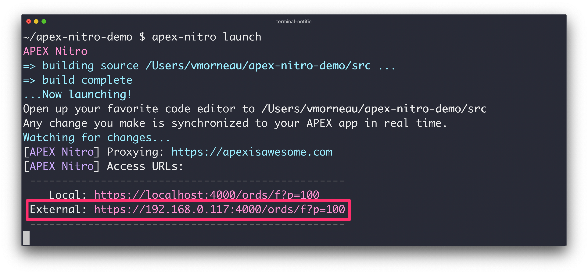

# Features

This document explains the main features of APEX Nitro in greater details.

## Browser synchronization in real time

Perhaps the number one reason to use APEX Nitro, browser synchronization allows you to experience real time changes to your APEX app.

Traditionally, if you make change to JavaScript or CSS within the APEX builder, you are required to save your page, run your page and test your changes. That involves a lot of clicks and it is not very efficient, especially when you have to do this over and over again. On the other hand, if you were already coding in files, you had to upload those files in APEX, then test those changes. This process is painfully redundant.

APEX Nitro connects your favorite code editor to your APEX app in real time. It detects that you are making changes to a file, then sends the code to APEX automatically. It is a time-saver like no other.


## Writing next generation JavaScript

JavaScript is a language that evolves very quickly. Some of the newest JavaScript features are incredibly powerful, and sometimes remove the need for additional libraries like jQuery. However, browsers are not implementing the newest JavaScript features at the same pace, so when writing next generation JavaScript it is important to compile that code back to a commonly supported standard. The process of transforming next generation code into current generation code can be quite tricky.

APEX Nitro comes with a compiler out of the box so you don't have to worry about browser compatibility. Write your best JavaScript today, and let APEX Nitro making it work in APEX.

Example:

`/myprojectpath/src/myproject.js`

```javascript
[1, 2, 3].map(n => n ** 2);

const x = [1, 2, 3];
foo([...x]);

let name = "Guy Fieri";
let place = "Flavortown";
`Hello ${name}, ready for ${place}?`;
```

Compiles to:

`/myprojectpath/build/myproject.js`

```javascript
"use strict";

[1, 2, 3].map(function (n) {
  return Math.pow(n, 2);
});

var x = [1, 2, 3];
foo([].concat(x));

var name = "Guy Fieri";
var place = "Flavortown";
"Hello ".concat(name, ", ready for ").concat(place, "?");
```

## File minification

APEX Nitro automatically removes unnecessary characters from your files without changing the functionality. These unnecessary characters usually include white space characters, new line, comments and sometimes block delimiters, which are used to add readability to the code but are not required for it to execute. This considerably enhances the performance due to smaller file sizes. Also, some variables are renamed in the process to save even more file size.

Example:

`/myprojectpath/src/myproject.js`

```javascript
apex.server.process(
  "test",
  {
    x01: "test",
    pageItems: "#P1_DEPTNO,#P1_EMPNO"
  },
  {
    success: function(data) {
      console.log(data);
    }
  }
);
```

Compiles to:

`/myprojectpath/build/myproject.min.js`

```javascript
apex.server.process("test",{x01:"test",pageItems:"#P1_DEPTNO,#P1_EMPNO"},{success:function(e){console.log(e)}});
```

This example has a compression ratio of 41.05%. It makes a considerable difference on large files.

Because of the minification process, we want to use the `#MIN#` substitution string in APEX when referencing files. Example: `#APP_IMAGES#myproject#MIN#.js`


APEX Nitro does the minification automatically in Pro mode.

## Single file output

As your application JavaScript annd CSS codebase grow, you may want to split your code into smaller files for maintainability purposes. However, having to serve multiple files to your APEX app is not efficient, especailly when you start adding or removing files. A good practice is to serve a single file to your app.

APEX Nitro allows you to create the file structure you want, with as many files as you need, then compiles them into a single library for your APEX app.

Example

```javascript
// 📁 hi.js
function sayHi(user) {
  alert(`Hello, ${user}!`);
}

export {sayHi};

// 📁 bye.js
function sayBye(user) {
  alert(`Bye, ${user}!`);
}

export {sayBye};

// 📁 main.js
import {sayHi} from './hi.js';
import {sayBye} from './bye.js';

sayHi('John'); // Hello, John!
sayBye('John'); // Bye, John!
```

Compiles to

```javascript
(function () {
  'use strict';

  function sayHi(user) {
    alert("Hello, ".concat(user, "!"));
  }

  // 📁 bye.js
  function sayBye(user) {
    alert("Bye, ".concat(user, "!"));
  }

  sayHi('John'); // Hello, John!

  sayBye('John'); // Bye, John!

}());
```

## Sourcemaps

After CSS and JavaScript code has been minified and merged to a single file output, it becomes difficult to identify where an error occurs in the original source file. When that happens, your browser's debugger indicates that the error is on line 1.

Example without sourcemaps:  


Clicking on the link opens the code, and shows this mess:  


It's hard to read and understand. To overcome this, APEX Nitro automatically adds sourcemaps to your code, which aid in debugging minified and concatenated files by easily tracing the code back to the original source file.

Example of Sass sourcemaps:  


Example of JavaScript sourcemaps:  


## Code linting

As opposed to PL/SQL being a compiled language, CSS and JavaScript are interpreted at runtime. The obvious downside of interpreted languages is that we can slip syntactically invalid code very easily. APEX Nitro includes code linters that will notify the developer of syntax errors upon saving a file.

Example of a JavaScript error warning:


Example of a CSS error warning:


When an error is raised, the source file will not be compiled. You will have to fix the error before the file is compiled and synchronized to APEX again.

## CSS Preprocessing

A CSS preprocessor is a program that allows generation of CSS from the preprocessor enhanced syntax making the CSS structure more readable and easier to maintain. The main benefits of a CSS preprocessor are to implement CSS variables, nesting and functions. APEX Nitro comes pre-wired for SASS and Less.

Example:

`/myprojectpath/src/myproject.scss`

```scss
$primary-color: #333;

body {
  color: $primary-color;
  
  ul {
    margin: 0;
  }
}
```

Compiles to:

`/myprojectpath/build/myproject.css`

```css
body {
  color: #333;
}
body ul {
  margin: 0;
}

```

## CSS Autoprefixer

Some CSS properties require complex knowledge of browser vendor-specific prefixes. These special CSS properties are hard to remember and can cause a lot of problems in browser compatibility.

APEX Nitro comes with auto-prefixer out of the box. No longer does the developer need to remember which properties apply to Chrome, Safari, Firefix or older browsers.

Example:

`/myprojectpath/src/myproject.css`

```css
.example {
    display: grid;
    transition: all .5s;
    user-select: none;
    background: linear-gradient(to bottom, white, black);
}
```

Compiles to:

`/myprojectpath/build/myproject.css`

```css
.example {
    display: -ms-grid;
    display: grid;
    -webkit-transition: all .5s;
    -o-transition: all .5s;
    transition: all .5s;
    -webkit-user-select: none;
       -moz-user-select: none;
        -ms-user-select: none;
            user-select: none;
    background: -webkit-gradient(linear, left top, left bottom, from(white), to(black));
    background: -o-linear-gradient(top, white, black);
    background: linear-gradient(to bottom, white, black);
}
```

## Responsive Development

Due to the nature of the APEX builder, a lot of APEX developers design their application with a "Desktop first" UI. A mobile is something developer should keep in mind all the time, not at the end of a development cycle.

By setting the `launch.ghostMode` to `true` option in your `apexnitro.config.json`, you can make responsive design development much easier by mirroring of clicks, scrolls and input typing in multiple devices at once.

When you run `apex-nitro launch`, look for the external URL:



By connecting multiple devices to that external URL on the same network, all devices start synchronizing together (clicking, typing and scrolling).
