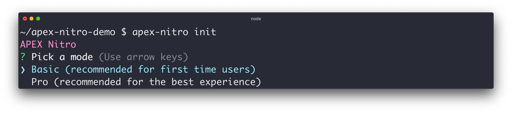
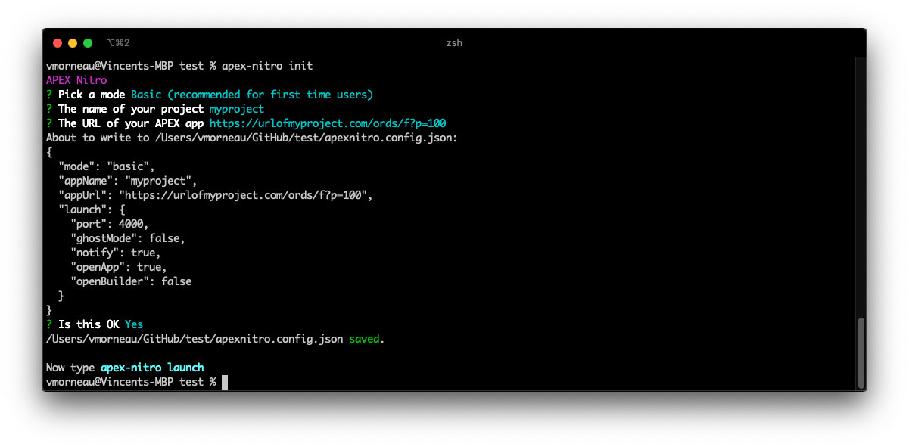
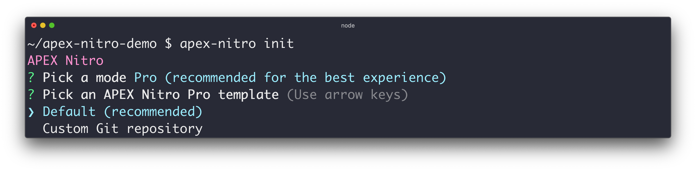
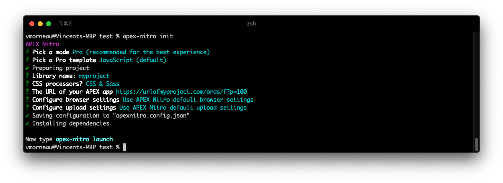

# Initialize your project

APEX Nitro needs to know a few things before connecting your APEX app.

To initialize an APEX Nitro project, go to the directory where your files (JavaScript, CSS, other) will be.

```bash
cd /myprojectpath/
```

Our directory is currently empty:

```bash
|-/myprojectpath/
```

Execute the following command and a series of questions will be asked:

```bash
apex-nitro init
```

## Choosing a mode

When you run `apex-nitro init`, the first question is "Pick a mode" and you will be asked to choose between Basic and Pro.

- Basic mode is recommended for first time users as it a really simple way to get started
- Pro mode is recommended for the best experience and the best performance



After choosing a mode, the following questions will depend on the mode you picked.

## Basic mode properties

| Property                | Description                                                                                                                      | Default       |
| ----------------------- | -------------------------------------------------------------------------------------------------------------------------------- | ------------- |
| appName                 | Name of your APEX Nitro project                                                                                                  |
| appUrl                  | URL of your APEX app                                                                                                             |
| srcFolder               | Path to where the source files are (relative to the current command line directory)                                              | `./src`       |
| launch.port             | Port that will be used to synchronize code in real time when using `apex-nitro launch`                                           | `4000`        |
| launch.ghostMode        | Clicks, Scrolls & Form inputs on any device will be mirrored to all devices during development when using `apex-nitro launch`    | `false`       |
| launch.notify           | Enables small notifications in the browser when code changes are detected when using `apex-nitro launch`                         | `true`        |
| launch.openApp          | Opens your APEX app in your browser when using `apex-nitro launch`                                                               | `true`        |
| launch.openBuilder      | Opens the APEX builder for your app when using `apex-nitro launch`                                                               | `false`       |
| upload.destination      | Destination for your files when uploading them to the APEX Shared Components using `apex-nitro upload`                           | `application` |
| upload.path             | Path to the binary files of SQLcl. Used for uploading files to the APEX Shared Component using `apex-nitro upload`               | `sqlcl`       |
| upload.username         | User to your APEX parsing schema. Used for uploading files to the APEX Shared Component using `apex-nitro upload`                |
| upload.password         | (Optional) Password to your APEX parsing schema. Used for uploading files to the APEX Shared Component using `apex-nitro upload` |
| upload.connectionString | Connection string to your APEX parsing schema. Used for uploading files to the APEX Shared Component using `apex-nitro upload`   |



## Pro mode properties

TODO

The properties will depend on which Pro template you picked.



### JavaScript (default)

More info: https://github.com/dfrechdev/apex-nitro-template-js

TODO



### React (beta)

More info: https://github.com/vincentmorneau/apex-nitro-template-react

Work in progress (coming soon)

### Custom Git repository

Check with the Git repository for the properties it offers.

## Creating the `apexnitro.config.json` file

After running `apex-nitro init`, our directory now contains a project configuration file:

```bash
|-/myprojectpath/
  |-apexnitro.config.json
```

The answers to the questions from `apex-nitro init` are saved to a file called `apexnitro.config.json` in the same directory as `apex-nitro init` was run. The content of `apexnitro.config.json` are the properties for your APEX Nitro project and it drives your APEX Nitro experience.

## Modifying your `apexnitro.config.json` file

If you wish to make modifications to your APEX Nitro project configuration, you can either:

1. Execute `apex-nitro init` again and overwrite current configuration.
1. Edit the project `apexnitro.config.json` file and make the changes needed.
