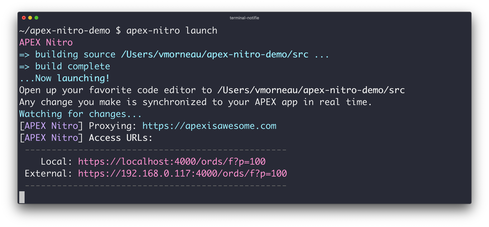

# Build & Launch

This is where the APEX Nitro magic happens. APEX Nitro compiles your local files

### Build your files

Compiles all local files into a single build more efficient for APEX consumption.

```bash
apex-nitro build
```


### Launch your app

Enable real time coding in your app by executing a simple command:

```bash
apex-nitro launch
```



This includes the `apex-nitro build` step.

Open up your favorite code editor. Any change you make to your files will be synchronized to your APEX app in real time.

Tip: use `apex-nitro launch --nomin` to skip the building of production files that includes *.min.js and *.min.css. This will accelerate the build time while you are developing.
