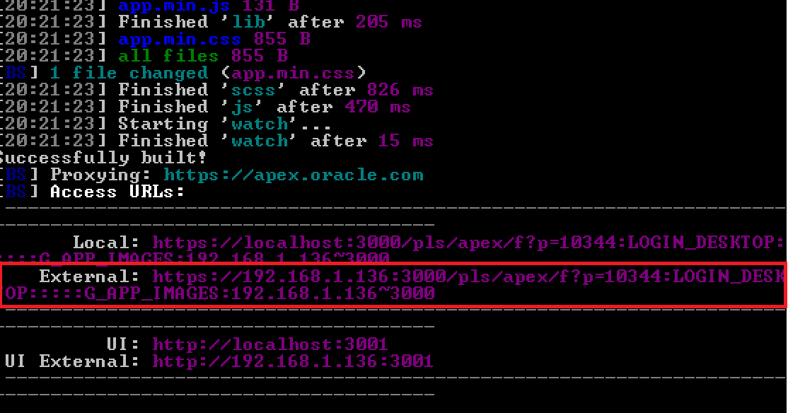

apex-frontend-boost lets you synchronize your development across multiple devices at the same time.

It means, you can develop on your main desktop computer and have your tablet and your mobile phone mimic the actions without lifting a finger.

In order to do this, you'll have to:

1) Activate the option in your project `config.json` file. Just like:
```json
{
    "sandbox": {
        "appURL": "https://apex.oracle.com/pls/apex/f?p=10344:101",
        "multipleDevices": true
    }
}
```

2) Run apex-frontend-boost again and notice the *external* address on your command line console.


3) Launch a browser on your second (or third) device.

4) Instead of going to your real application URL, go to the external address above.

For instance, if your APEX application is  
 **https://apex.oracle.com/pls/apex/f?p=10344:LOGIN_DESKTOP**  
 instead you'll go to  
 **https://192.168.1.136:3000/pls/apex/f?p=10344:LOGIN_DESKTOP:::::G_APP_IMAGES:192.168.1.136~3000**

> It's very important to set G_APP_IMAGES as above with the host and port separated by the tilt sign.
