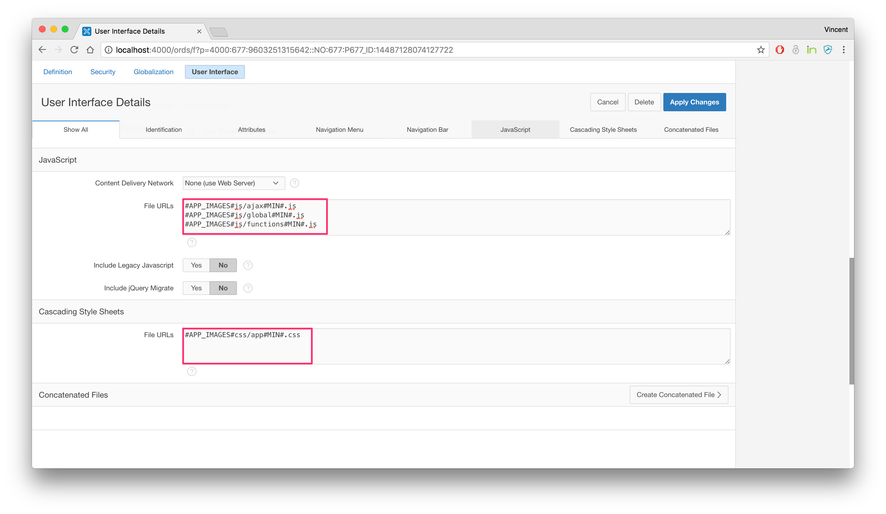
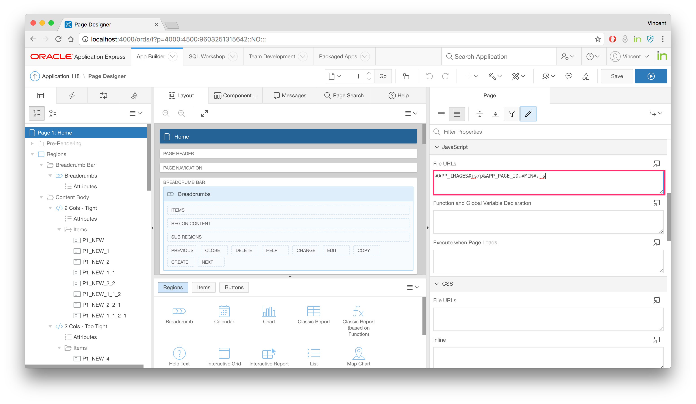

# APEX Nitro Patterns

### 1. Concatenation Hybrid
This pattern consists of concatenating CSS but not JavaScript. It's logical for many projects to merge the stylesheets into a single file, but keeping the functional JavaScript into separate files.

Here is the configuration:

Group | Option | Value
--- | --- | ---
N/A | Mode | advanced
JavaScript | Processor | default
CSS | Language | sass

#### Sass
Because we are using Sass as a CSS Preprocessor, we are able to import files into other files. [See this example](../examples/demo-sass/src/scss) to understand how the `import` works. This mechanism is our concatenation.

In the APEX application, there will be a single point of reference for `#APP_IMAGES#css/app.css`.

#### JavaScript
We are going to create two types of files: public files and private files. The public files are going to be shared across the whole application. The private files are going to be used on a single page only.

**Example:**
```
|-/src/
	|-js
		|-ajax.js
		|-global.js
		|-functions.js
		|-p1.js
		|-p2.js
		|-p3.js
		|-p99.js
```

The only CSS file and the first three JavaScript files can be referenced in the Shared Components - User Interface Attributes:


The page-specific JavaScript files can be references in the appropriate page properties:


--- 

### APEX Nitro and you
Are **YOU** using APEX Nitro differently? 

Please feel free to open a pull request and describe your pattern here, or contact [Vincent Morneau](https://github.com/vincentmorneau) with a brief explanation.
