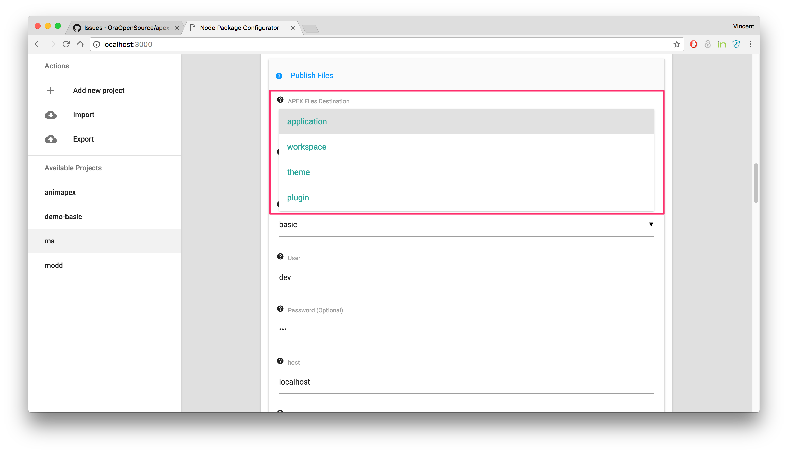
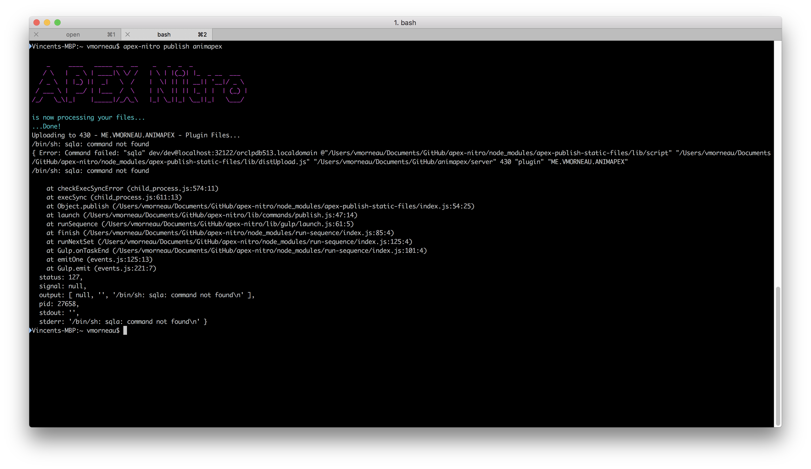
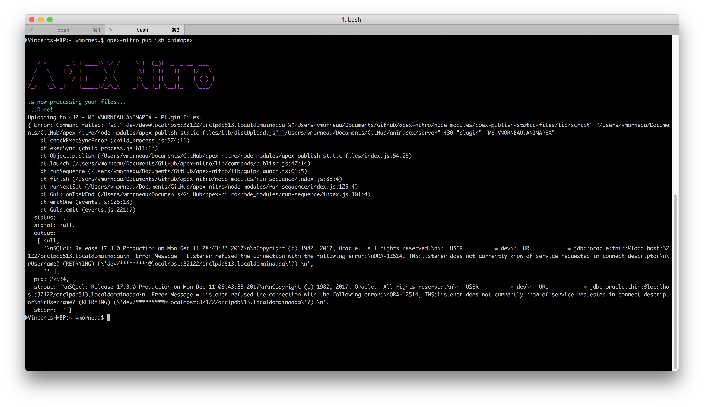

# APEX Nitro Publish
When you are done developing, you might want to publish your new code directly to your APEX application.

```
apex-nitro publish <project>
```


The files will be uploaded and stored according to your configuration. Run `apex-nitro config <project>` and pick your file destination here:



### Troubleshooting

1. **Command not found**

   

   `apex-nitro publish <project>` will fail if the `SQLcl path` in `apex-nitro config <project>` is invalid.

   If you have added SQLcl to your environment variable, the `SQLcl path` should be `sql`.

   If not, you can use an absolute path to the SQLcl directory in your system, such as `/Users/vmorneau/sqlcl/bin/sql`.

2. **Connection String fails**

   

   `apex-nitro publish <project>` can fail if the publish parameters in `apex-nitro config <project>` are invalid.

   APEX Nitro **does not** validate the connection string. The publish feature will only work if these parameters are valid.

   Double check your username, password, hostname, port, sid or service name.
