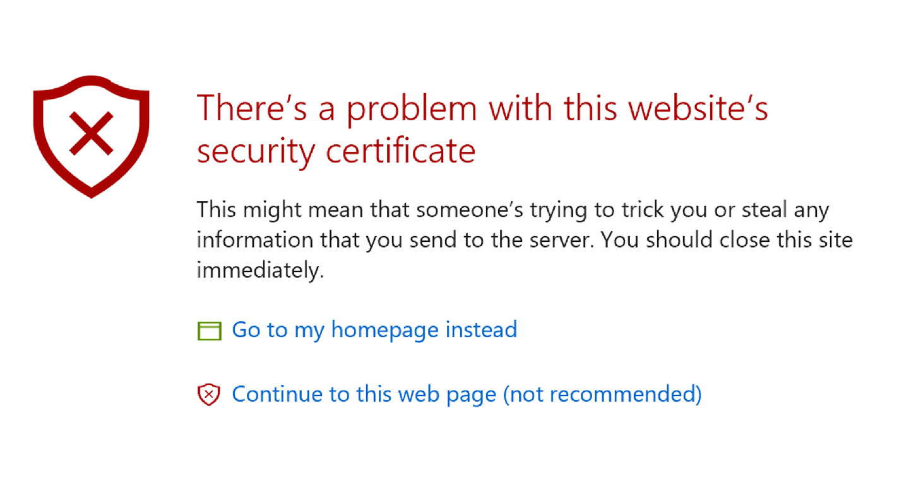
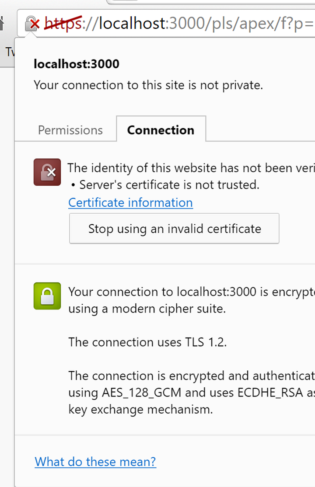

When using the Browsersync feature, you will encounter browser warnings when running your APEX application for the first time:

This is normal because you are serving the files from your own computer with self signed certificates. Please continue.

You will access your APEX application normally, except for this sign near your browser's URL:

This is normal and it will only occur on your development environment when using the Browsersync feature.
