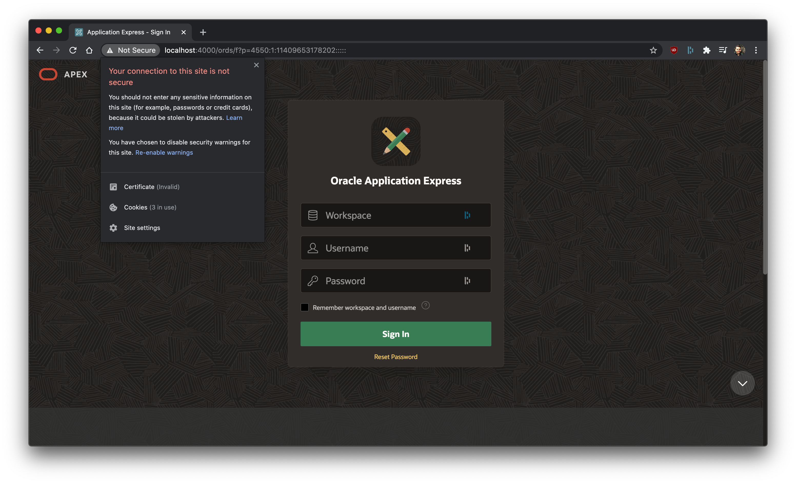

# Troubleshooting

Here are some of the most common issues with APEX Nitro.

If you can't find a solution to your problem, please [submit an issue on GitHub](https://github.com/OraOpenSource/apex-nitro/issues).

## Problems with the command line options

Run `apex-nitro help`


## EPERM: operation not permitted

Sometimes when you are trying to build a project with `apex-nitro build` or `apex-nitro launch`, you might get an error like this:

```bash
APEX Nitro
is now building your files...
Error: EPERM: operation not permitted
```

It means your operating system is locking the folder APEX Nitro is trying to build, so it is unable to process your files.

To fix this problem, close down any program that might interfere with your project directory (example: Windows Explorer, Finder, or your code editor) and start again.

## Unable to upload files

[Common issues regarding `apex-nitro upload`.](./upload.md)

## APEX app doesn't pick up the changes from local files

Behind the scenens, `apex-nitro launch` uses an HTTP header variable to communicate between the local files and the APEX app (using web sockets).

Make sure you are picking up APEX Nitro's HTTP header variable with the [required setup](./connect.md)

See https://github.com/OraOpenSource/apex-nitro/issues/223 for more details.

## Self-signed SSL Warnings

When using APEX Nitro, you may encounter browser warnings before running your APEX app for the first time:


This is normal because you are serving the files from your own computer with self-signed certificates. Hit "Proceed:


You will access your APEX app normally, along with a benign warning near your browser's URL:



This is normal and it will only occur on your development environment.

## Issues with `app-icon.css` and `app-icon.svg`

Since APEX 18.2, two files are automatically added to the Shared Components > Static Application Files: `app-icon.css` and `app-icon.svg`. Those two files are at the root of #APP_IMAGES#.

There is currently no plan to have APEX Nitro support those two static files, as we think they should not be there to begin with.

You will have to manually manage those two files, if you wish to support them, which we don't recommend.

## Couldn't open browser

The following warning message can happen if you run APEX Nitro in a headless environment such as Docker:

`[APEX Nitro] Couldn't open browser (if you are using BrowserSync in a headless environment, you might want to set the open option to false)`

This is just a warning and should not affect your experience. If you wish to turn it off, simply edit your project `apexnitro.config.json` and change `launch.open` to `false`.
