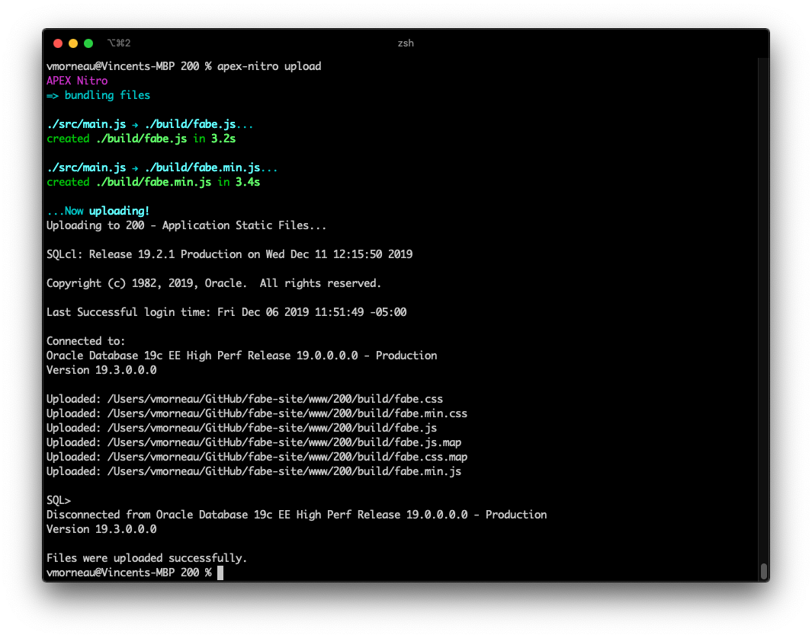
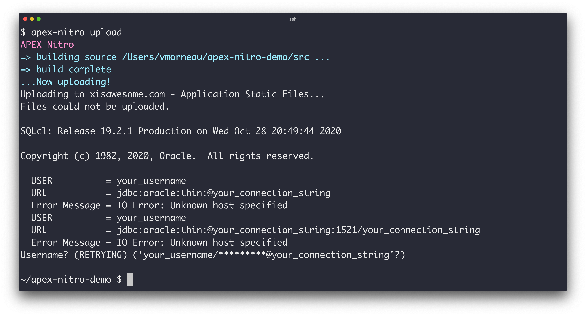

# Uploading your files to APEX Shared Components

When you are done developing your JavaScript, CSS and other files locally, you probably want to upload those files to your APEX app. The most popular method is to upload them to `Shared Components > Application Static Files`. Traditionally, uploading those files have been a lengthy and redundant process as it requires a lot of clicks for the developer.

APEX Nitro offers a quick command to upload the entire content of a local directory to the APEX Shared Components:

```bash
apex-nitro upload
```



The files will be uploaded and stored according to your `apexnitro.config.json` properties.

| Property                | Description                                                                      | Default       |
| ----------------------- | -------------------------------------------------------------------------------- | ------------- |
| upload.tns_admin        | Path to TNS_ADMIN directory. Required when connecting to Oracle Cloud for wallet |               |
| upload.destination      | Destination for your files when uploading them to the APEX Shared Components     | `application` |
| upload.libDir             | Path to the binary files of Oracle Instant Client.                                               |        |
| upload.username         | User to your APEX parsing schema.                                                |
| upload.password         | (Optional) Password to your APEX parsing schema.                                 |
| upload.connectionString | Connection string to your APEX parsing schema.                                   |

Note: `apex-nitro upload` is optional as you might want to put the files on a web server rather than the Shared Components.

## Troubleshooting

### Could not establish the connection



`apex-nitro upload` can fail if the upload properties in your `apexnitro.config.json` file are invalid.

Verify your `upload` properties  (`username`, `password`, `connection string`) in `apexnitro.config.json` and retry.
